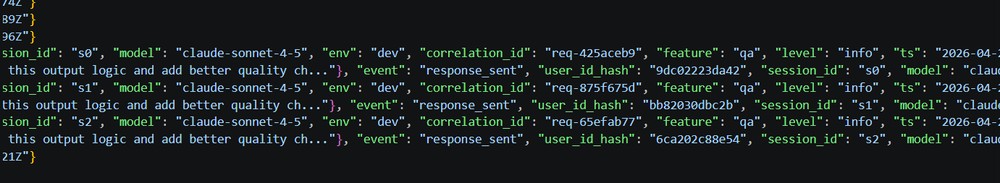
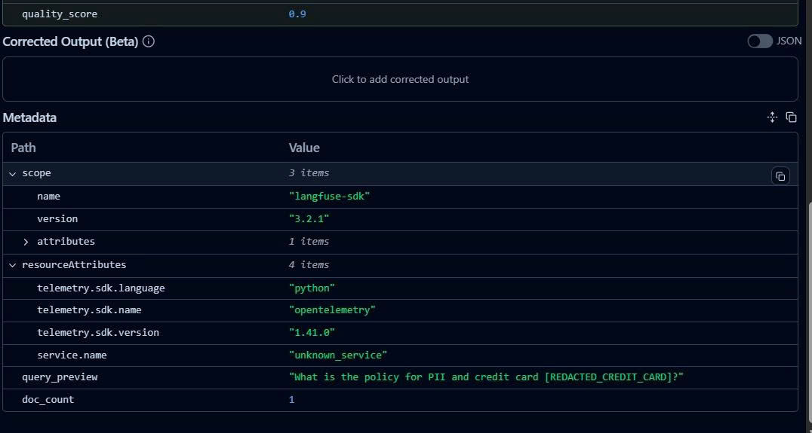
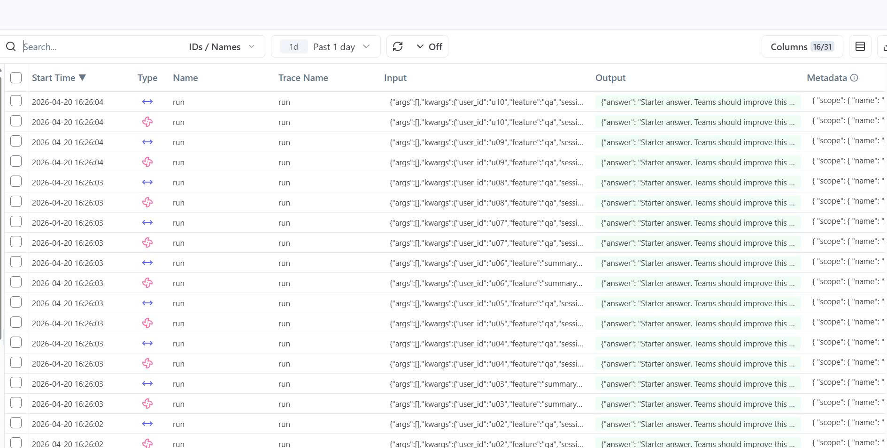
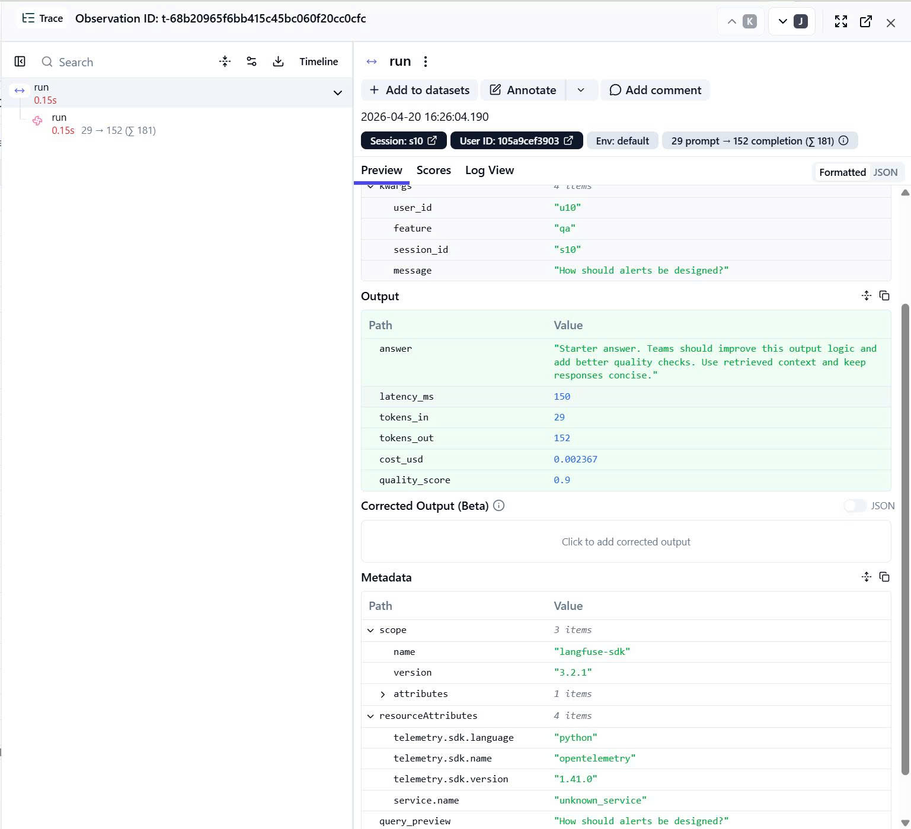
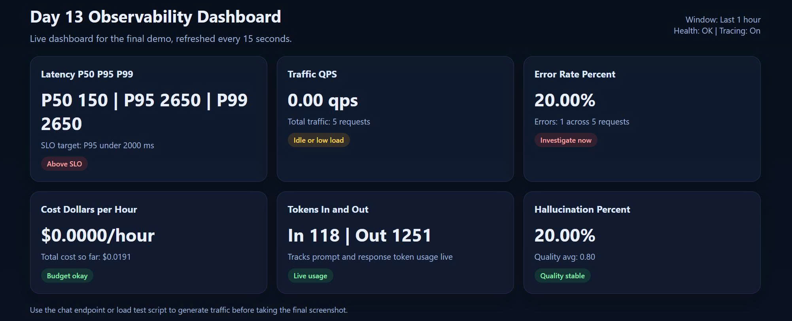
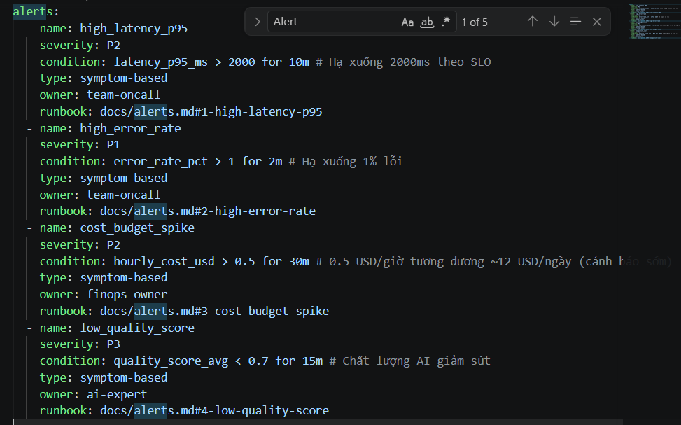
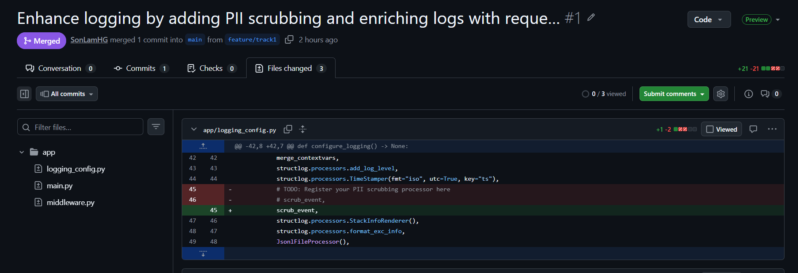
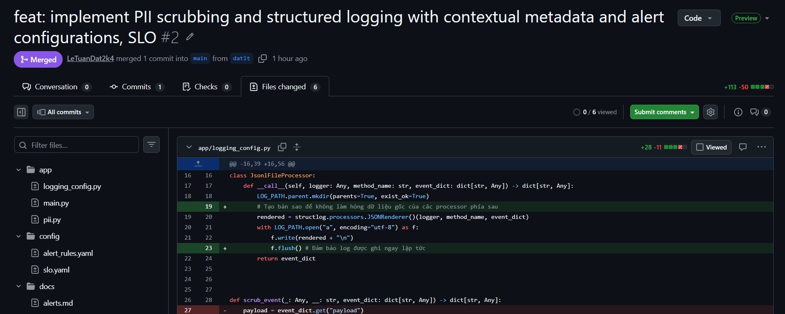
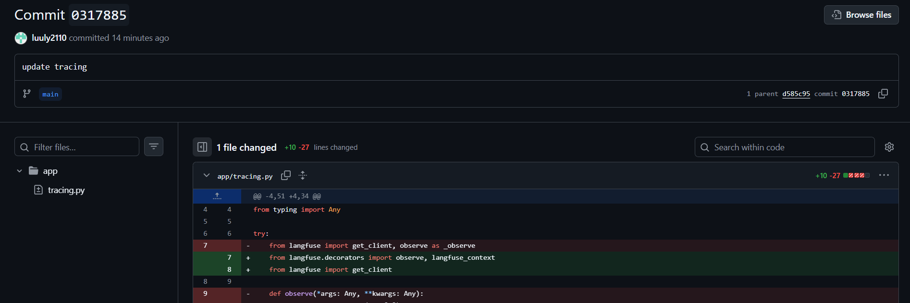
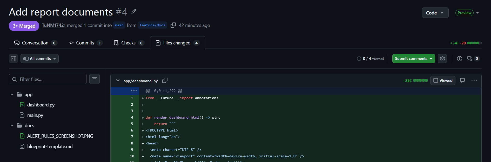

# Day 13 Observability Lab Report

> **Instruction**: Fill in all sections below. This report is designed to be parsed by an automated grading assistant. Ensure all tags (e.g., `[GROUP_NAME]`) are preserved.

## 0. Project Overview
- [PROJECT_NAME]: Day 13 Observability Lab
- [PROJECT_TYPE]: FastAPI agent observability implementation
- [PROJECT_GOAL]: Build and demonstrate a small FastAPI-based agent instrumented with structured logging, correlation ID propagation, PII scrubbing, tracing, metrics, SLOs, alerts, and a final blueprint report.
- [OBSERVABILITY_ARCHITECTURE]: Request enters FastAPI through middleware, correlation_id is attached and propagated through logs, application events are recorded as JSON logs, PII is scrubbed before persistence, traces are sent to Langfuse, metrics are aggregated in-memory, and dashboards plus alerts are used to monitor health, cost, latency, and quality.

## 1. Team Metadata
- [GROUP_NAME]: Group 9
- [REPO_URL]: https://github.com/TuNM17421/Nhom09-E403-Day13
- [MEMBERS]:
  - Member A: [Name] Hoàng Sơn Lâm | Role: Backend & Security
  - Member B: [Name] Lưu Linh Ly | Role: Tracing & Enrichment
  - Member C: [Name] Lê Tuấn Đạt | Role: Reliability & Incidents
  - Member D: [Name] Nguyễn Mạnh Tú | Role: UI & Integration Lead

---

## 2. Group Performance (Auto-Verified)
- [VALIDATE_LOGS_FINAL_SCORE]: 100/100
- [TOTAL_TRACES_COUNT]: 56
- [PII_LEAKS_FOUND]: 0

---

## 3. Technical Evidence (Group)

> Add screenshots into a shared evidence folder and paste the relative paths below.

### 3.1 Logging & Tracing
- [EVIDENCE_CORRELATION_ID_SCREENSHOT]: 
- [EVIDENCE_PII_REDACTION_SCREENSHOT]: 
- [EVIDENCE_TRACE_LIST_SCREENSHOT]: 
- [EVIDENCE_TRACE_WATERFALL_SCREENSHOT]: 
- [TRACE_WATERFALL_EXPLANATION]: This trace represents a healthy baseline request. The main run span completed in about 150 ms with stable token usage of 29 input tokens and 152 output tokens, showing that the system responded correctly without abnormal latency or failures. It serves as a useful reference point for comparison against incident scenarios such as rag_slow and cost_spike.
- [LOGGING_SUMMARY]: Logs are emitted in JSON format, include correlation IDs, and contain contextual metadata for debugging.

### 3.2 Dashboard & SLOs
- [DASHBOARD_6_PANELS_SCREENSHOT]: 
- [DASHBOARD_NOTES]: Main 6 panels currently include Latency P50/P95/P99, Traffic QPS, Error Rate %, Cost $/hour, Tokens in/out, and Hallucination %.
- [SLO_TABLE]:
| SLI | Target | Window | Current Value |
|---|---:|---|---:|
| Latency P95 | < 2000ms | 7d | 150ms |
| Error Rate | < 1% | 7d | 0% |
| Cost Budget | < $2.0/day or < $0.5/hour | 1d | ~$0.017/day equivalent from current sample load |
| Quality Proxy | > 80% | 7d | 80% |

### 3.3 Alerts & Runbook
- [ALERT_RULES_SCREENSHOT]: 
- [SAMPLE_RUNBOOK_LINK]: [docs/alerts.md](docs/alerts.md)
- [ALERT_SUMMARY]: The team implemented 4 symptom-based alerts in [config/alert_rules.yaml](config/alert_rules.yaml): high_latency_p95, high_error_rate, cost_budget_spike, and low_quality_score. These alerts cover latency, reliability, spending, and AI answer quality. Each alert is mapped to a concrete runbook in [docs/alerts.md](docs/alerts.md), including severity, trigger condition, impact, first checks, and mitigation steps. The team uses the debug path Metrics -> Traces -> Logs to investigate any alert that fires.

---

## 4. Incident Response (Group)
- [SCENARIO_NAME]: rag_slow, tool_fail, cost_spike
- [SYMPTOMS_OBSERVED]: Three representative incidents were tested. For rag_slow, the API still returned a valid answer but latency increased sharply to 2650 ms with correlation_id req-482509ba, indicating severe slowdown in the retrieval path. For tool_fail, the API returned an error payload with detail RuntimeError, proving a reliability failure in the internal execution path. For cost_spike, the request succeeded but tokens_out rose to 464 and cost_usd reached 0.007053 with correlation_id req-e6dc606d, indicating abnormal cost growth despite normal latency.
- [ROOT_CAUSE_PROVED_BY]: Root cause was proved using a combination of response payloads, metrics, traces, and logs. The rag_slow scenario was confirmed by high latency evidence tied to correlation_id req-482509ba. The tool_fail scenario was proved by the RuntimeError response and corresponding error logs. The cost_spike scenario was proved by unusually high output token count and increased cost in the response payload and metrics.
- [DEBUG_PATH]: Metrics -> Traces -> Logs
- [FIX_ACTION]: The team followed the observability workflow by first detecting abnormal metrics, then checking the related traces, and finally confirming the details in structured logs. For rag_slow, the team identified the slow retrieval path and disabled or mitigated the injected latency scenario. For tool_fail, the team isolated the failing internal path and restored normal handling. For cost_spike, the team verified excessive token generation and tuned the path to reduce unnecessary output cost.
- [PREVENTIVE_MEASURE]: The team added alert thresholds for latency, error rate, cost spike, and low quality score. Preventive actions include lowering retrieval load, adding retry and fallback handling for tool failures, setting stronger token and cost limits, and continuously monitoring quality and cost through the dashboard and Langfuse traces.

---

## 5. Individual Contributions & Evidence

### Hoàng Sơn Lâm
- [ROLE]: Backend & Security
- [TASKS_COMPLETED]: Correlation ID propagation, structured logging, log schema verification
- [EVIDENCE_LINK]: 

### Lê Tuấn Đạt
- [ROLE]: Tracing & Enrichment
- [TASKS_COMPLETED]: Trace instrumentation, metadata tagging, context enrichment
- [EVIDENCE_LINK]: 

### Lưu Linh Ly
- [ROLE]: Reliability & Incidents
- [TASKS_COMPLETED]: SLO definitions, alert rules, incident analysis and mitigation
- [EVIDENCE_LINK]: 

### Nguyễn Mạnh Tú
- [ROLE]: UI & Integration Lead
- [TASKS_COMPLETED]: Dashboard design, evidence collection, report assembly, demo flow
- [EVIDENCE_LINK]: 

---

## 6. Bonus Items (Optional)
- [BONUS_COST_OPTIMIZATION]: (Description + Evidence)
- [BONUS_AUDIT_LOGS]: (Description + Evidence)
- [BONUS_CUSTOM_METRIC]: (Description + Evidence)

---

## 7. Submission Packaging Checklist
- [v] All screenshot paths are filled in
- [v] All member names are filled in
- [v] Final validator score is updated
- [v] Total trace count is updated
- [v] Incident response section is complete
- [v] Commit or PR evidence is included for every member
- [v] Report is ready for demo and grading review
